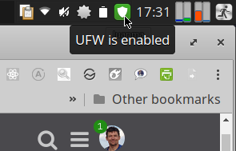

# ufwIconbar  (Add an icon with UFW status to the panel)
Show an icon into panel when UFW (Uncomplicated FireWall) is active/desactive.
Tested with XFCE4 Desktop environment (Manjaro and Xubuntu)
    

Requisites:  yad

  pacman -S yad
     
  or
  
  apt-get install yad    

then copy script **gufw_icon.sh** to some directory and add to application autostart menu of your linux distribution.

More info here:
https://archived.forum.manjaro.org/t/how-to-add-an-ufw-status-icon-to-the-panel/38559
